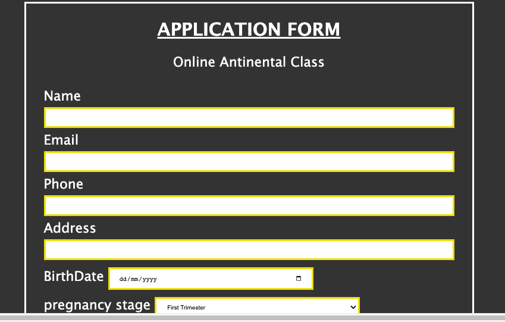

Welcome to My readme page.
Hi. 
my name is bright Anyiador and i am a student at Code institute, i am also a full time worker at Lloyds banking group. 

during this project which took 3 days to build i have encountered alot of changes and had to go back to the training manual of code institute to get answers . i have also learned alot of code from the site: https://www.w3schools.com/css/css_rwd_frameworks.asp#gsc.tab=0&gsc.q=video. among many others. 
the text and words on this site where major contents and teachings from https://www.winchesterhospital.org/health-library/article?id=101070#:~:text=Your%20first%20trimester%20lasts%20until,between%20weeks%2038%20and%2042. and pregnancybirthbaby websites. though some of the words have been modified and adjusted i still have no copy right to this content , just for educational purpose only.
a special appreciation to Mr. Tomasz Ostroga and Mrs. Lucimeri Andretta both students of Code institute for their help and support during this project. 
after the first initial project built i which had 6 pages and links,with commits i got from my mentor, i had to start all over again. with just a short time to go i had to submit this project this way. had changes making the page responsive . went over the web to get answers and was able to get through that. 
positioning items was also very hard for me as some times where easily moved but others gave more complex issues.
forgive my manners as i am not used to saying or using the word "problem"
in general i want to thank every code institute staff and mentors for all their support and help.
Happy New Year to Everyone

PREGNANCY GUIDE

this project is about the beautiful part of recreation and process of pregnancy. this was inspired by my wife during her pregnancy period.
during my time with code institute we have just found out that we are pregnant and got very excited and ofcourse its not enough just to wait for information from the Doctors so i went online to get some information and to read about this entire stage and how best to help my wife during this period.  though we lost our baby on 14th December 2022 due to miscarriage but i was kin to making sure this project is completed and to support the enlightment about the importance and value of pregnancy care and support .

Features
In the site i have included detailed information on the 3 stages of pregnancy and the various pictures to support what is expected. this will enable every reader (male/female) to have a clear details and picture what stage they are in. i have also included a form for antinental class online. as it could be very difficult at this time with cost of living crises and other difficulties which could hinder as person from been able to go for antinental class where teachings of pregnancy and care are taught. wer have make it possible or woment to be able to access this class and teachings online. once registered they are included to the classes backed on the preiod / stages of pregnancy and they can also meet people who are at the same stage with them as they share thoughts and experiences together.
a video was also included in the site to express the beauty of been pregnant .

Navigation Bar
the page have been make quit simple so as to make the readers experience easy and enjoyable.
i have included the introduction page which is also the index page . thois contain the basic and further information on the first / second stages of pregnancy.
next is the third trimester nav bar. this is also very important as it contain general information before birth and during the preparation of delivery.  
a registration form was included to enable the reader register for the online antinental class.

Testing
i have tested this site using W3 validator and found these errors (Error: Stray end tag head.

From line 13, column 1; to line 13, column 7

"></form>↩</head>↩<body

Error: Start tag body seen but an element of the same type was already open.

From line 14, column 1; to line 14, column 6). but fter chanking site i have not been able to correct this as i didnt understand why the error came up.

Validator Testing
HTML

Deployment
This section should describe the process you went through to deploy the project to a hosting platform (e.g. GitHub)

The site was deployed to GitHub pages. The steps to deploy are as follows:
In the GitHub repository, navigate to the Settings tab
From the source section drop-down menu, select the Master Branch
Once the master branch has been selected, the page will be automatically refreshed with a detailed ribbon display to indicate the successful deployment.
The live link can be found here - https://code-institute-org.github.io/love-running-2.0/index.html

Credits
In this section you need to reference where you got your content, media and extra help from. It is common practice to use code from other repositories and tutorials, however, it is important to be very specific about these sources to avoid plagiarism.

You can break the credits section up into Content and Media, depending on what you have included in your project.

Content
The text for the Home page was taken from Wikipedia Article A
Instructions on how to implement form validation on the Sign Up page was taken from Specific YouTube Tutorial
The icons in the footer were taken from Font Awesome
Media
The photos used on the home and sign up page are from This Open Source site
The images used for the gallery page were taken from this other open source site
Congratulations on completing your Readme, you have made another big stride in the direction of being a developer!

Other General Project Advice
Below you will find a couple of extra tips that may be helpful when completing your project. Remember that each of these projects will become part of your final portfolio so it’s important to allow enough time to showcase your best work!

One of the most basic elements of keeping a healthy commit history is with the commit message. When getting started with your project, read through this article by Chris Beams on How to Write a Git Commit Message

Make sure to keep the messages in the imperative mood
When naming the files in your project directory, make sure to consider meaningful naming of files, point to specific names and sections of content.

For example, instead of naming an image used ‘image1.png’ consider naming it ‘landing_page_img.png’. This will ensure that there are clear file paths kept.
Do some extra research on good and bad coding practices, there are a handful of useful articles to read, consider reviewing the following list when getting started:

Writing Your Best Code
HTML & CSS Coding Best Practices
Google HTML/CSS Style Guide
Getting started with your Portfolio Projects can be daunting, planning your project can make it a lot easier to tackle, take small steps to reach the final outcome and enjoy the process!
